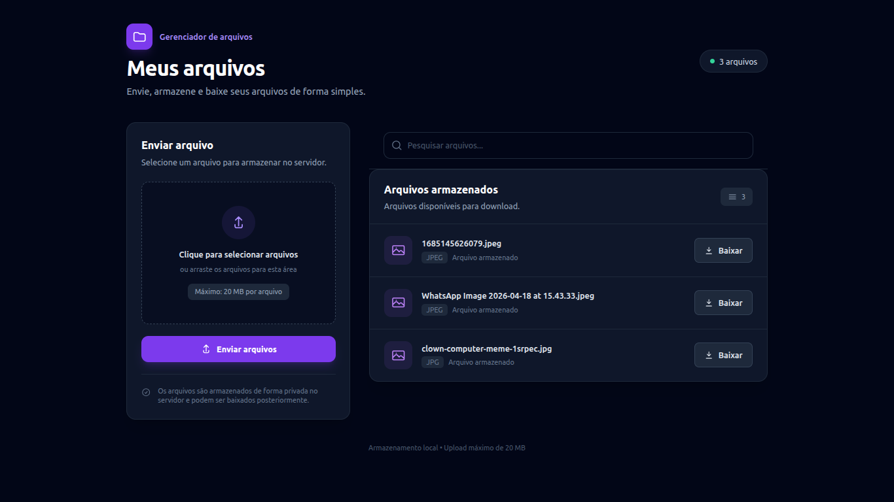
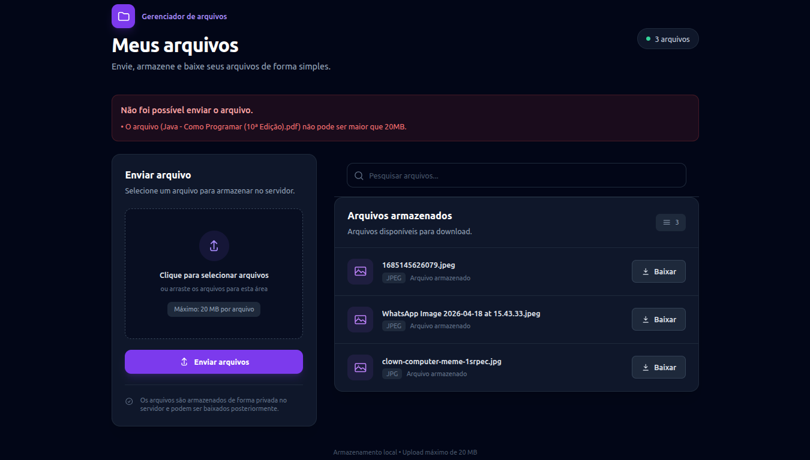
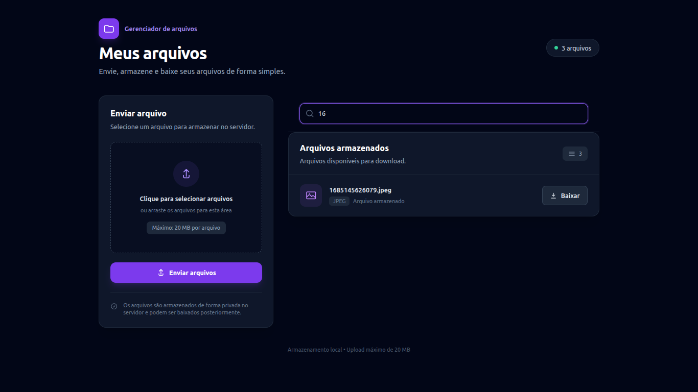

## Projeto: Servidor de Arquivos

<p>Aplicação web desenvolvida com Laravel para enviar, listar e baixar arquivos em uma interface simples e intuitiva. Funcionando como um servidor local em rede.</p>

## Sobre o Projeto

<p>O Servidor de Arquivos é um projeto desenvolvido para praticar conceitos de desenvolvimento web com Laravel, manipulação de arquivos, validação de dados e organização de aplicações.</p>

## Screenshots

### Tela principal



### Validação de Arquivos


### Barra para Pesquisar Arquivos


## Funcionalidades

<ul>
    <li>Upload de arquivos</li>
    <li>Listagem de arquivos enviados</li>
    <li>Pesquisa de arquivos pelo nome</li>
    <li>Download de arquivos</li>
    <li>Validação do tamanho do arquivo</li>
</ul>

## Tecnologias

<ul>
    <li>PHP 8.3+</li>
    <li>Laravel 13.34.0</li>
    <li>Blade</li>
    <li>Tailwind CSS</li>
    <li>JavaScript</li>
</ul>

## Pré-requisitos para Executar o Projeto

<ul>
    <li>PHP 8.3+</li>
    <li>Composer</li>
    <li>Extensões do PHP exigidas pelo Laravel</li>
</ul>

## Instalação

### Clone o Projeto:

```
git clone https://github.com/samuel-gustavo/servidor-arquivos.git
```

### Acesse o diretório:

```
cd servidor-arquivos
```

### Instale as dependências:

```
composer install
```

### Configure o ambiente:

```
cp .env.example .env
```
<p>Configure as variáveis necessárias no .env, conforme o seu ambiente local.</p>

```
php artisan key:generate
```
<p>Criar uma chave de criptografia única para o seu projeto Laravel, para que seu projeto funcione, e salvá-la dentro do seu arquivo .env</p>

```
mkdir -p storage/app/local_arquivos
```
<p>Crie uma pasta local para que seus arquivos sejam armazenados</p>

```
php artisan serve
```
<p>Acesse o servidor usando o endereço: <a href="http://127.0.0.1:8000" target="_blank" rel="noopener noreferrer">http://127.0.0.1:8000</a></p>

## Armazenamento

<p>Os arquivos são armazenados localmente em storage/app/local_arquivos, utilizando o disco de armazenamento configurado no Laravel.</p>

## Autor

### Desenvolvido por [Dev_Samuel_Gustavo](https://github.com/samuel-gustavo)
